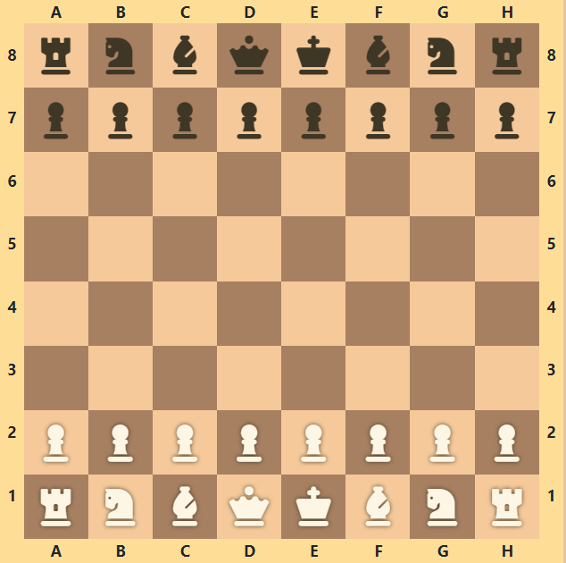

# React-chess
The project was developed for the purpose of playing chess. While it is under development, but now you can use it for the game, because it has the main functionality for moving pieces, the ability to check and checkmate the opponent.

To write the program were used: 
- Javascript 
- React 
- HTML
- Bootstrap
- Css

The project is based on a component approach and reusing these same components (which is the main feature of React).

More about the project

1.You can change theme of your game 

