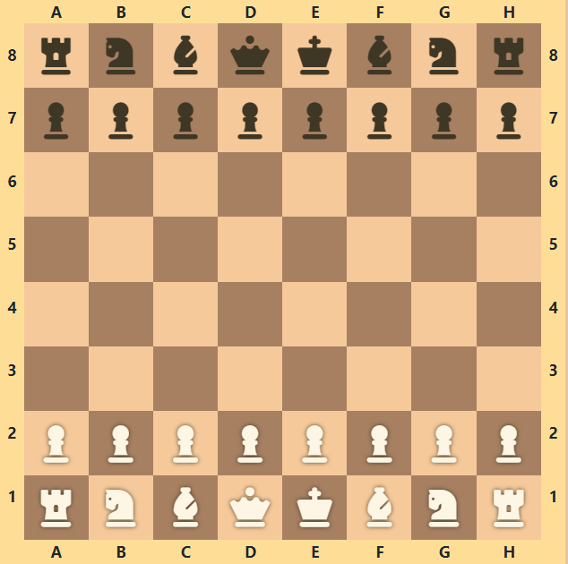
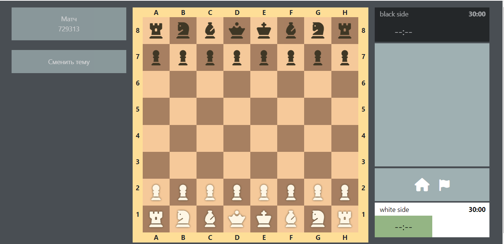
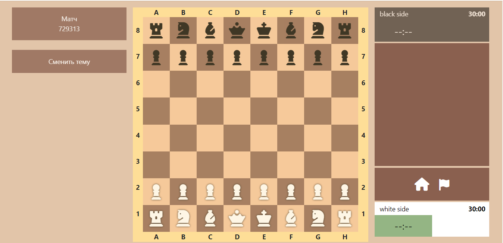
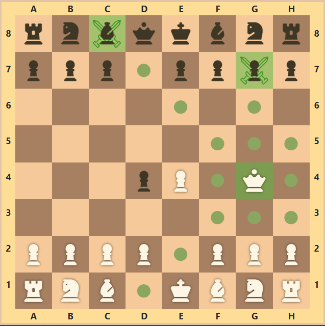
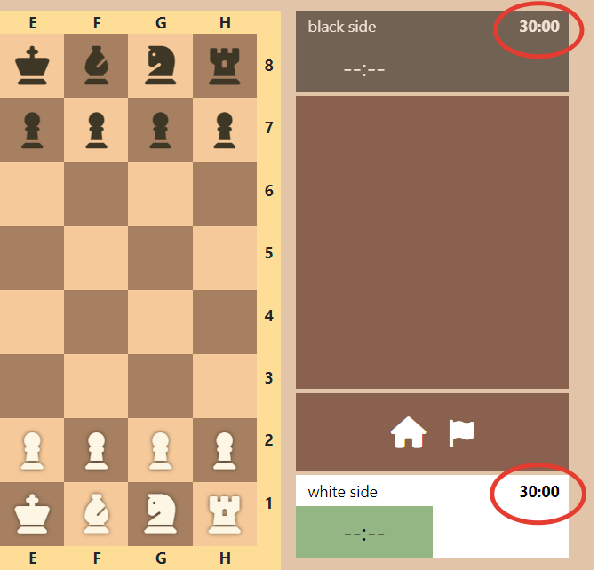
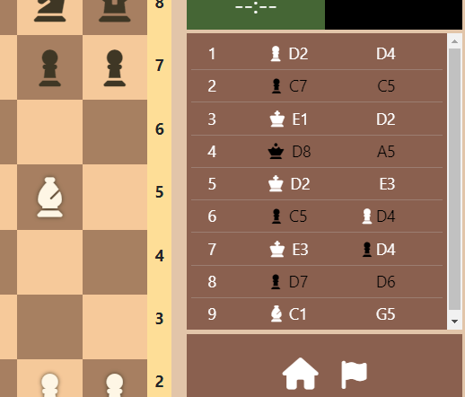
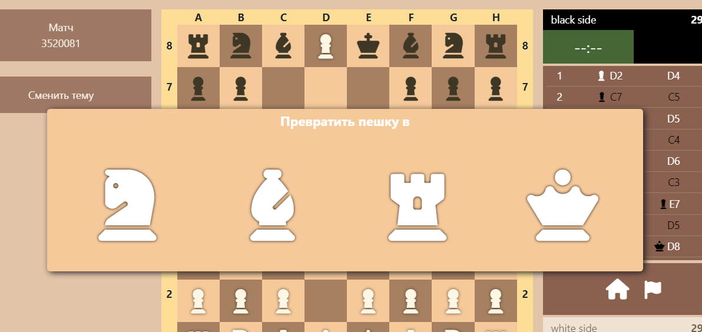

# React-chess
Проект был разработан для игры в шахматы. Пока он находится в процессе разработки, но вы уже можете использовать его для игры, поскольку основной функционал по 
переемещению фигур, возможности ставить шах и мат противнику уже доступен.

Для написания программы использовались: 
- Javascript 
- React 
- HTML
- Bootstrap
- Css

Проект основан на функциональном подходе и переиспользовании компонент (что является одной из главных преимуществ Реакт).

**Подробности о проекте**

1.Вы можете изменить тему своей игры

Темная тема

Светлая тема

2. Вы можете видеть потенциальные ходы своих фигур

3.У каждого игрока есть свой таймер, показывающий оставшееся время игры

4. С правой стороны веб-приложения вы можете видеть борд с историей ходов игроков

5.Когда ваша пешка достигает края доски, она может превратиться в любую фигуру (кроме короля и самой себя)

